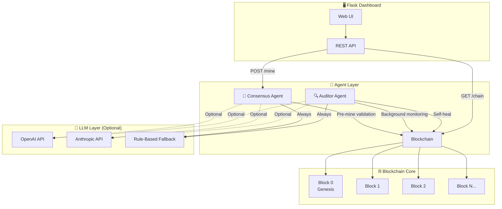

# ⛓️ Agent-Driven Blockchain Voting System

> An intelligent blockchain voting system powered by **autonomous AI agents** for auditing, consensus validation, and self-healing ."


---

## 🧠 Why Is This Different From a Normal Database?

| Feature | Normal Database | This System |
|---|---|---|
| **Data Integrity** | Trust the admin | Cryptographic proof (SHA-256 hash chain) |
| **Tamper Detection** | Manual audits | 🔍 **Auditor Agent** — real-time, autonomous monitoring |
| **Validation** | Static SQL constraints | 🤝 **Consensus Agent** — intelligent NLP-powered peer review |
| **Recovery** | Restore from backup | 🩹 **Self-Healing** — automatic revert to last valid state |
| **Transparency** | Query logs manually | 📊 **Live Dashboard** — agent activity visible in real-time |

### The "Agentic" Defense

When the panel asks *"Why not just use MySQL?"* — here's your answer:

1. **Self-Healing**: If the Auditor Agent detects a hash mismatch, it automatically triggers a *"Revert to Last Known Good State"* protocol. No human intervention needed.

2. **Intelligent Validation**: Unlike a standard `CHECK` constraint, the Consensus Agent can interpret *intent* and *context* using natural language processing. It catches anomalies that static rules miss.

3. **Autonomous Operation**: The agents run as background threads, continuously monitoring and validating. The system defends itself without a DBA on call.

---

## 🏗️ Architecture



---

## 📂 Project Structure

```
/Agent-Blockchain-Project
│
├── /agents
│   ├── __init__.py
│   ├── auditor.py       # 🔍 Auditor Agent — background integrity monitor
│   └── consensus.py     # 🤝 Consensus Agent — pre-mine transaction validator
│
├── /blockchain
│   ├── __init__.py
│   ├── block.py         # The Block class (SHA-256 + Proof of Work)
│   └── chain.py         # Blockchain management (genesis, mining, validation)
│
├── app.py               # Flask web server, dashboard UI, all API routes
├── requirements.txt     # Python dependencies
└── README.md            # You're reading this!
```

---

## 🚀 Quick Start

### Prerequisites

- Python 3.10+
- pip

### 1. Clone & Install

```bash
git clone https://github.com/YOUR_USERNAME/Agent-Blockchain-Project.git
cd Agent-Blockchain-Project
pip install -r requirements.txt
```

### 2. Run the System

```bash
python app.py
```

You'll see:

```
=======================================================
  ⛓️  Agent-Driven Blockchain Voting System
  🤖 Auditor Agent: Starting...
  🤝 Consensus Agent: Ready
  🌐 Dashboard: http://localhost:5001
=======================================================
```

### 3. Open the Dashboard

Navigate to **http://localhost:5001** in your browser.

### 4. (Optional) Enable LLM-Powered Agents

Set an API key to upgrade agents from rule-based to full LLM reasoning:

```bash
# Option A: OpenAI
export OPENAI_API_KEY="sk-..."

# Option B: Anthropic
export ANTHROPIC_API_KEY="sk-ant-..."

python app.py
```

> **Note**: The system works perfectly without any API key. LLM integration is an optional enhancement.

---

## 🤖 How the Agents Work

### 🔍 Auditor Agent

The Auditor runs as a **background daemon thread**, polling the blockchain every 5 seconds:

```
┌─────────────────────────────────────┐
│  Every 5 seconds:                   │
│  1. Walk the entire chain           │
│  2. Recalculate every block's hash  │
│  3. Verify all previous_hash links  │
│  4. If invalid:                     │
│     → Generate explanation (LLM/    │
│       rule-based)                   │
│     → Log to Agent Logs             │
│     → Trigger self-healing revert   │
└─────────────────────────────────────┘
```

**Self-Healing**: When tampering is detected, the agent removes all blocks from the first corrupted block onward, restoring the chain to its last known valid state.

### 🤝 Consensus Agent

Before any vote is mined into a block, the Consensus Agent performs a **simulated peer review**:

- ✅ **Required fields** — `voter_id` and `candidate` must be present
- ✅ **Duplicate detection** — no voter can vote twice
- ✅ **Format validation** — field lengths, no injection characters
- ✅ **LLM reasoning** (optional) — natural language anomaly assessment

---

## 🔌 API Endpoints

| Route | Method | Description |
|---|---|---|
| `/` | `GET` | Dashboard UI |
| `/chain` | `GET` | Full blockchain as JSON |
| `/mine` | `POST` | Submit vote → Consensus review → mine block |
| `/tamper/<index>` | `POST` | Deliberately corrupt a block (demo) |
| `/logs` | `GET` | All agent logs as JSON |
| `/health` | `GET` | System health check |

### Mine a Vote (cURL Example)

```bash
curl -X POST http://localhost:5001/mine \
  -H "Content-Type: application/json" \
  -d '{"voter_id": "VOTER-001", "candidate": "Alice Johnson"}'
```

---

## 🛡️ Security Model

```
+-- Block N-1 --+     +-- Block N --+     +-- Block N+1 --+
| prev_hash: .. | ←── | prev_hash   | ←── | prev_hash     |
| data: {...}   |     | data: {...}  |     | data: {...}    |
| hash: abc123  | ──→ | hash: def456 | ──→ | hash: ghi789   |
| nonce: 42     |     | nonce: 87    |     | nonce: 113     |
+---------------+     +--------------+     +----------------+
         ↑                    ↑
    If data changes,    Hash no longer
    hash changes →      matches prev_hash
                        in next block →
                        CHAIN BROKEN →
                        Auditor Agent
                        detects & heals
```

---

## 📜 License

MIT — Use freely for your college projects!

---

*Built with ❤️ and Python.*

