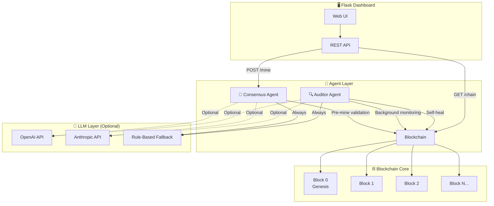

<!-- Header Block -->
<div align="center">
  <br />
  <!-- Glowing Animated Blockchain Banner (Pure Vector CSS SVG) -->
  <svg width="100%" height="160" viewBox="0 0 800 160" fill="none" xmlns="http://www.w3.org/2000/svg" style="background: #0f0c1b; border-radius: 24px; border: 1px solid rgba(139, 92, 246, 0.2);">
    <style>
      .text-title {
        font-family: 'Sora', 'Inter', system-ui, -apple-system, sans-serif;
        font-weight: 800;
        font-size: 38px;
        fill: url(#blockGradient);
        filter: drop-shadow(0px 10px 15px rgba(139, 92, 246, 0.35));
      }
      .text-subtitle {
        font-family: 'Inter', system-ui, sans-serif;
        font-weight: 500;
        font-size: 13px;
        fill: #a78bfa;
        letter-spacing: 0.22em;
      }
      .glow-agent {
        animation: floatAgent 7s ease-in-out infinite alternate;
      }
      @keyframes floatAgent {
        0% { transform: translate(0px, 0px) scale(1); filter: blur(28px); opacity: 0.4; }
        100% { transform: translate(25px, -15px) scale(1.1); filter: blur(38px); opacity: 0.6; }
      }
    </style>
    <!-- Background Neon Blobs -->
    <circle class="glow-agent" cx="200" cy="80" r="60" fill="#7c3aed" />
    <circle class="glow-agent" cx="600" cy="80" r="50" fill="#f59e0b" style="animation-delay: -3.5s;" />
    
    <!-- Title Text -->
    <text x="50%" y="80" dominant-baseline="middle" text-anchor="middle" class="text-title">AGENT-DRIVEN BLOCKCHAIN VOTING</text>
    <text x="50%" y="120" dominant-baseline="middle" text-anchor="middle" class="text-subtitle">CRYPTOGRAPHIC INTEGRITY & AUTONOMOUS AI AGENTS</text>
    
    <defs>
      <linearGradient id="blockGradient" x1="0%" y1="0%" x2="100%" y2="0%">
        <stop offset="0%" stop-color="#8b5cf6" />
        <stop offset="50%" stop-color="#f59e0b" />
        <stop offset="100%" stop-color="#8b5cf6" />
      </linearGradient>
    </defs>
  </svg>

  <p>
    <br />
    
    
    
    
  </p>
  
  <p>
    An intelligent blockchain voting system powered by <b>autonomous background AI agents</b> for integrity auditing, pre-mine consensus validation, and automated self-healing recoveries.
  </p>
</div>

<hr style="border: 0; height: 1px; background-image: linear-gradient(to right, rgba(139, 92, 246, 0), rgba(139, 92, 246, 0.4), rgba(139, 92, 246, 0));" />

<!-- Blockchain Live Ledger Board (Pure Vector CSS SVG) -->
<div align="center">
  <h3>⛓️ Live Ledger Block Chain & Auditor Sweeper</h3>
  <br />
  <svg width="640" height="150" viewBox="0 0 640 150" fill="none" xmlns="http://www.w3.org/2000/svg" style="background: #0f0c1b; border-radius: 20px; border: 1px solid rgba(139,92,246,0.3); box-shadow: 0 10px 30px rgba(139,92,246,0.15);">
    <style>
      .block-rect {
        stroke: #8b5cf6;
        stroke-width: 1.5;
        fill: #16122c;
      }
      .link-connector {
        stroke: #f59e0b;
        stroke-width: 2;
        stroke-dasharray: 6 6;
        animation: flowLink 2s infinite linear;
      }
      .audit-laser {
        animation: laserScan 4s infinite linear;
      }
      @keyframes flowLink {
        0% { stroke-dashoffset: 24; }
        100% { stroke-dashoffset: 0; }
      }
      @keyframes laserScan {
        0% { x: 50; width: 0px; opacity: 0; }
        10% { width: 30px; opacity: 1; }
        90% { width: 30px; opacity: 1; }
        100% { x: 580; width: 0px; opacity: 0; }
      }
      .ledger-text {
        font-family: 'JetBrains Mono', monospace;
        font-size: 10px;
        fill: #a78bfa;
      }
      .hash-text {
        font-family: 'JetBrains Mono', monospace;
        font-size: 8px;
        fill: #6d28d9;
      }
    </style>

    <!-- Block 0 -->
    <rect class="block-rect" x="60" y="45" width="100" height="60" rx="8" />
    <text x="110" y="65" text-anchor="middle" class="ledger-text">GENESIS 0</text>
    <text x="110" y="85" text-anchor="middle" class="hash-text">#0000abc12</text>
    
    <!-- Link 1 -->
    <line class="link-connector" x1="160" y1="75" x2="260" y2="75" />

    <!-- Block 1 -->
    <rect class="block-rect" x="260" y="45" width="100" height="60" rx="8" />
    <text x="310" y="65" text-anchor="middle" class="ledger-text" style="fill: #f59e0b;">BLOCK 1</text>
    <text x="310" y="85" text-anchor="middle" class="hash-text" style="fill: #d97706;">#abc12def4</text>

    <!-- Link 2 -->
    <line class="link-connector" x1="360" y1="75" x2="460" y2="75" />

    <!-- Block 2 -->
    <rect class="block-rect" x="460" y="45" width="100" height="60" rx="8" />
    <text x="510" y="65" text-anchor="middle" class="ledger-text">BLOCK 2</text>
    <text x="510" y="85" text-anchor="middle" class="hash-text">#def45ghi7</text>

    <!-- Auditor Agent Sweeping Laser -->
    <rect class="audit-laser" x="50" y="38" width="30" height="74" rx="4" fill="rgba(139,92,246,0.15)" stroke="#8b5cf6" stroke-width="1.5" style="filter: drop-shadow(0 0 6px #8b5cf6);" />
    <text x="320" y="130" text-anchor="middle" font-family="'Sora', sans-serif" font-size="9px" fill="rgba(167, 139, 250, 0.7)">🔍 AUDITOR AGENT INTEGRITY LOOP ACTIVE</text>
  </svg>
</div>

<br />

---

## 🧠 Why Is This Different From a Normal Database?

| Feature | Normal Database | This System |
|---|---|---|
| **Data Integrity** | Trust the admin | Cryptographic proof (SHA-256 hash chain) |
| **Tamper Detection** | Manual audits | 🔍 **Auditor Agent** — real-time, autonomous monitoring |
| **Validation** | Static SQL constraints | 🤝 **Consensus Agent** — intelligent NLP-powered peer review |
| **Recovery** | Restore from backup | 🩹 **Self-Healing** — automatic revert to last valid state |
| **Transparency** | Query logs manually | 📊 **Live Dashboard** — agent activity visible in real-time |

### The "Agentic" Defense

When panels ask *"Why not just use MySQL?"* — here's your answer:

1. **Self-Healing**: If the Auditor Agent detects a hash mismatch, it automatically triggers a *"Revert to Last Known Good State"* protocol. No human intervention needed.
2. **Intelligent Validation**: Unlike standard static constraints, the Consensus Agent can interpret *intent* and *context* using LLMs or advanced matching. It catches vote anomalies that rules miss.
3. **Autonomous Operation**: The agents run as background daemon threads, continuously defending the ledger without human intervention.

---

## 🏗️ Architecture



---

## 📂 Project Structure

```
/Agent-Blockchain-Project
│
├── /agents
│   ├── __init__.py
│   ├── auditor.py       # 🔍 Auditor Agent — background integrity monitor
│   └── consensus.py     # 🤝 Consensus Agent — pre-mine transaction validator
│
├── /blockchain
│   ├── __init__.py
│   ├── block.py         # The Block class (SHA-256 + Proof of Work)
│   └── chain.py         # Blockchain management (genesis, mining, validation)
│
├── app.py               # Flask web server, dashboard UI, all API routes
├── requirements.txt     # Python dependencies
└── README.md            # You're reading this!
```

---

## 🚀 Quick Start

### Prerequisites
* Python 3.10+
* pip

### 1. Install Dependencies
```bash
pip install -r requirements.txt
```

### 2. Run the System
```bash
python app.py
```

You'll see:
```
=======================================================
  ⛓️  Agent-Driven Blockchain Voting System
  🤖 Auditor Agent: Starting...
  🤝 Consensus Agent: Ready
  🌐 Dashboard: http://localhost:5001
=======================================================
```

### 3. Open the Dashboard
Navigate to **http://localhost:5001** in your browser.

---

## 🤖 How the Agents Work

### 🔍 Auditor Agent
The Auditor runs as a background thread, polling the blockchain every 5 seconds to walk the chain, recalculate hashes, and verify previous_hash links. If corruption is found, the agent automatically triggers the **self-healing revert protocol** to restore the chain to the last valid state.

### 🤝 Consensus Agent
Before a vote is mined, the Consensus Agent performs a simulated peer review: validation of voter fields, double-voting prevention, length limits, and NLP/LLM-powered reasoning (optional).

---

## 📜 License

MIT License — Use freely for your college projects!

---

<div align="center" style="background: radial-gradient(circle, rgba(139,92,246,0.08) 0%, transparent 80%); padding: 24px; border-radius: 16px;">
  <p style="font-family: 'Sora', sans-serif; font-size: 13px; font-weight: 600; color: #8b5cf6; margin: 0;">
    built by anuj with love and nicotine
  </p>
</div>
