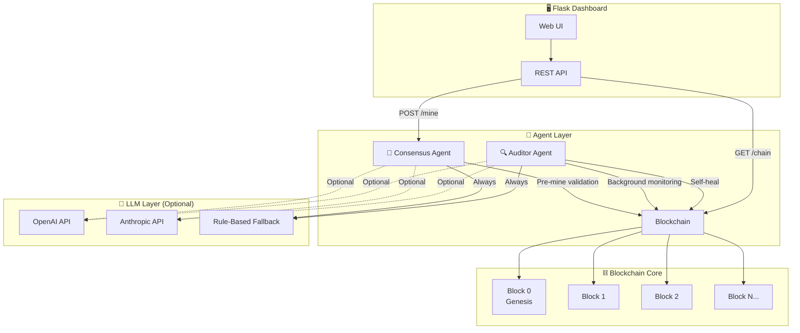

<!-- Header Block -->
<div align="center">
  <br />
  <!-- Glowing Animated Blockchain Banner (Pure Vector CSS SVG) -->
  

  <p>
    <br />
    
    
    
    
  </p>
  
  <p>
    An intelligent blockchain voting system powered by <b>autonomous background AI agents</b> for integrity auditing, pre-mine consensus validation, and automated self-healing recoveries.
  </p>
</div>

<hr style="border: 0; height: 1px; background-image: linear-gradient(to right, rgba(139, 92, 246, 0), rgba(139, 92, 246, 0.4), rgba(139, 92, 246, 0));" />

<!-- Blockchain Live Ledger Board (Pure Vector CSS SVG) -->
<div align="center">
  <h3>⛓️ Live Ledger Block Chain & Auditor Sweeper</h3>
  <br />
  
</div>

<br />

---

## 🧠 Why Is This Different From a Normal Database?

| Feature | Normal Database | This System |
|---|---|---|
| **Data Integrity** | Trust the admin | Cryptographic proof (SHA-256 hash chain) |
| **Tamper Detection** | Manual audits | 🔍 **Auditor Agent** — real-time, autonomous monitoring |
| **Validation** | Static SQL constraints | 🤝 **Consensus Agent** — intelligent NLP-powered peer review |
| **Recovery** | Restore from backup | 🩹 **Self-Healing** — automatic revert to last valid state |
| **Transparency** | Query logs manually | 📊 **Live Dashboard** — agent activity visible in real-time |

### The "Agentic" Defense

When panels ask *"Why not just use MySQL?"* — here's your answer:

1. **Self-Healing**: If the Auditor Agent detects a hash mismatch, it automatically triggers a *"Revert to Last Known Good State"* protocol. No human intervention needed.
2. **Intelligent Validation**: Unlike standard static constraints, the Consensus Agent can interpret *intent* and *context* using LLMs or advanced matching. It catches vote anomalies that rules miss.
3. **Autonomous Operation**: The agents run as background daemon threads, continuously defending the ledger without human intervention.

---

## 🏗️ Architecture



---

## 📂 Project Structure

```
/Agent-Blockchain-Project
│
├── /agents
│   ├── __init__.py
│   ├── auditor.py       # 🔍 Auditor Agent — background integrity monitor
│   └── consensus.py     # 🤝 Consensus Agent — pre-mine transaction validator
│
├── /blockchain
│   ├── __init__.py
│   ├── block.py         # The Block class (SHA-256 + Proof of Work)
│   └── chain.py         # Blockchain management (genesis, mining, validation)
│
├── app.py               # Flask web server, dashboard UI, all API routes
├── requirements.txt     # Python dependencies
└── README.md            # You're reading this!
```

---

## 🚀 Quick Start

### Prerequisites
* Python 3.10+
* pip

### 1. Install Dependencies
```bash
pip install -r requirements.txt
```

### 2. Run the System
```bash
python app.py
```

You'll see:
```
=======================================================
  ⛓️  Agent-Driven Blockchain Voting System
  🤖 Auditor Agent: Starting...
  🤝 Consensus Agent: Ready
  🌐 Dashboard: http://localhost:5001
=======================================================
```

### 3. Open the Dashboard
Navigate to **http://localhost:5001** in your browser.

---

## 🤖 How the Agents Work

### 🔍 Auditor Agent
The Auditor runs as a background thread, polling the blockchain every 5 seconds to walk the chain, recalculate hashes, and verify previous_hash links. If corruption is found, the agent automatically triggers the **self-healing revert protocol** to restore the chain to the last valid state.

### 🤝 Consensus Agent
Before a vote is mined, the Consensus Agent performs a simulated peer review: validation of voter fields, double-voting prevention, length limits, and NLP/LLM-powered reasoning (optional).

---

## 📜 License

MIT License — Use freely for your college projects!

---

<div align="center" style="background: radial-gradient(circle, rgba(139,92,246,0.08) 0%, transparent 80%); padding: 24px; border-radius: 16px;">
  <p style="font-family: 'Sora', sans-serif; font-size: 13px; font-weight: 600; color: #8b5cf6; margin: 0;">
    built by ANUJ with ❤️ while pink floyd's "Time" echoed in the background
  </p>
</div>
